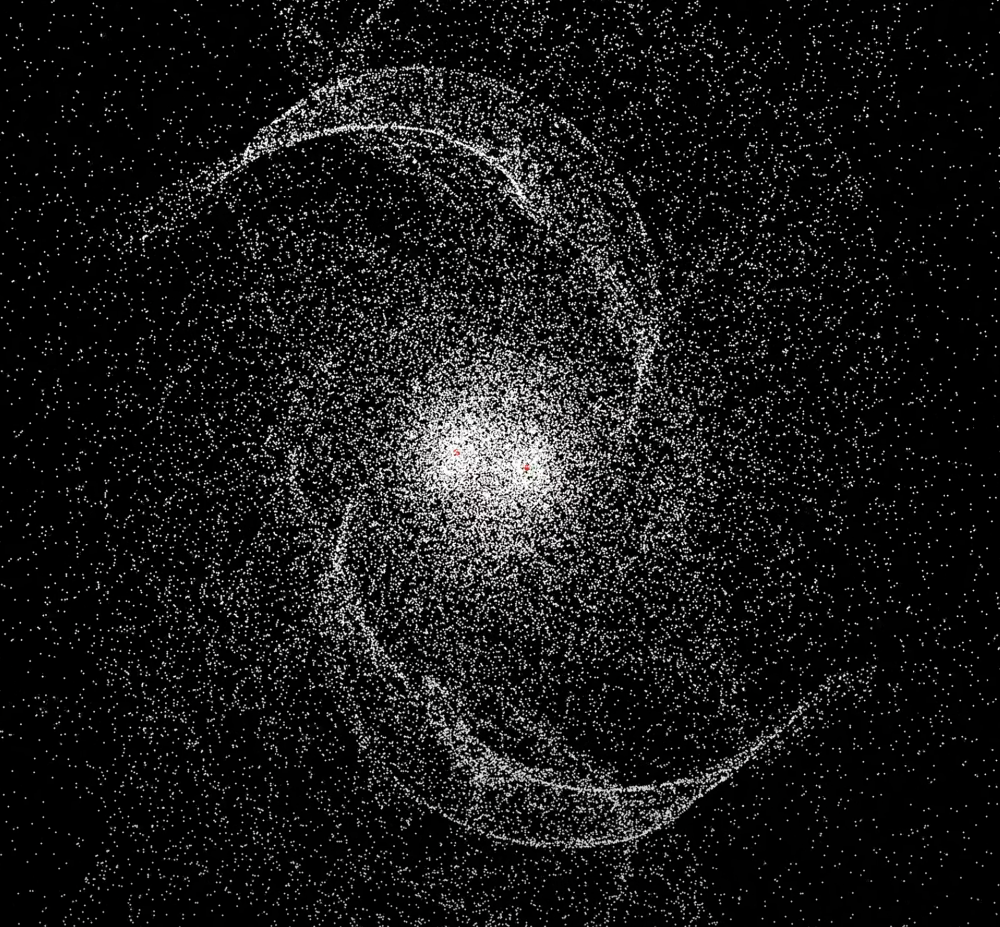

# N-body-simulation

## About the Project

 
    

This project implements N-body simulations for both CPU and CUDA versions, using both the direct sum and Barnes-Hut algorithms. The simulations include spiral galaxy, random body initializations, galaxy collision, and our solar system.

## Introduction

N-body simulation is a computational technique used in astrophysics to simulate the evolution of a system of particles, such as stars or galaxies, under the influence of gravitational forces. This project implements two different algorithms for N-body simulation: direct sum and Barnes-Hut. The direct sum algorithm is a simple but computationally expensive method that calculates the gravitational force between all pairs of particles. The Barnes-Hut algorithm is a more efficient method that uses a hierarchical tree structure to approximate the gravitational force between distant particles.

In addition to the algorithms, this project includes both CPU and CUDA versions of the simulation. The CPU version is implemented using C++ and OpenGL and is mainly for benchmarking purposes. The CUDA version is implemented using NVIDIA's CUDA framework for GPU acceleration and OpenCV for visualization. The Barnes-Hut CUDA implementation is able to simulate 5 million bodies in 1509 ms per iteration.

## Simulations

The project includes several N-body simulations, including:

* [Spiral galaxy](https://youtu.be/Sap3lGzhlzE): Simulates a spiral galaxy over time.
* Random body initializations: Simulates a system of randomly initialized bodies and their interactions.
* [Galaxy Collision](https://youtu.be/Krb5nEYRVaM): Simulates the collision of two galaxies and their resulting interactions.
* Solar system: Simulates the movement of the planets in our solar system (Sun, Mercury, Venus, Earth, Mars).

## Getting Started

To run the simulations, you will need an NVIDIA GPU with CUDA support for the CUDA version. Instructions for building and running the simulations are provided in the README.md file in each simulation directory.

## Contributions

Contributions to this project are welcome. If you find a bug or have an idea for a new feature, please open an issue or submit a pull request.

